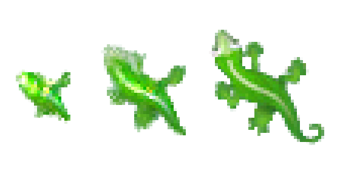

# neural-cellular-automata

<!-- PROJECT LOGO -->
 

  

  <h3 align="center">Unleashing emergent behavior through neural network and cellular automata fusion.</h3>

  

    Neural cellular automata (NCA) represent an incredible fusion of neural networks and cellular automata, enabling the simulation of complex systems and showcasing remarkable emergent behavior. NCAs offer a captivating approach to studying and understanding dynamic systems in various fields such as physics, biology, and artificial intelligence, making them truly amazing tools for exploration and discovery.
     
    <a href="https://distill.pub/2020/growing-ca/"><strong>Growing Neural Cellular Automata »</strong></a>
       
     
    <a href="https://distill.pub/2020/growing-ca/">Link1</a>
    ·
    <a href="https://distill.pub/2020/growing-ca/">Link2</a>
  

<!-- TABLE OF CONTENTS -->

  
Table of Contents

  <ol>
    <li>
      <a href="#prerequisites">Prerequisites</a>
    </li>
    <li>
      <a href="#installation">Installation</a>
    </li>
    <li>
      <a href="#usage">Usage</a>
    </li>
    <li>
      <a href="#models">Models</a>
    </li>
    <li>
      <a href="#dataset">Dataset</a>
    </li>
    <li>
      <a href="#project-structure">Project Structure</a>
    </li>
    <li>
      <a href="#contacts">Contacts</a>
    </li>
  </ol>

<!-- PREREQUISITES -->
## Prerequisites

<!-- INSTALLATION -->
## Installation

<!-- USAGE -->
## Usage

<!-- MODELS -->
## Models

<!-- DATASET -->
## Dataset

<!-- PROJECT STRUCTURE -->
## Project Structure

<!-- CONTACTS -->
## Contacts
