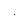

# neural-cellular-automata


<!-- PROJECT LOGO -->
<br />
<div align="center">
  <a href="https://github.com/erikhelmut/neural-cellular-automata/blob/main/animations/chest/L2/chest_sobel.gif">
    
  </a>
  &nbsp;
  <a href="https://github.com/erikhelmut/neural-cellular-automata/blob/main/animations/chest/L2/chest_sobel_damage.gif">
    
  </a>

  <h3 align="center">Unleashing emergent behavior through neural network and cellular automata fusion.</h3>

  <p align="center">
    Neural cellular automata (NCA) represent an incredible fusion of neural networks and cellular automata, enabling the simulation of complex systems and showcasing remarkable emergent behavior. NCAs offer a captivating approach to studying and understanding dynamic systems in various fields such as physics, biology, and artificial intelligence, making them truly amazing tools for exploration and discovery.
    <br />
    <a href="https://distill.pub/2020/growing-ca/"><strong>Growing Neural Cellular Automata »</strong></a>
    <br />  
    <br />
    <a href="https://www.youtube.com/watch?v=21ACbWoF2Oo">NCA PyTorch Walkthrough</a>
    ·
    <a href="https://medmnist.com">MedMnist</a>
    ·
    <a href="https://www.researchgate.net/lab/Medical-and-Environmental-Computing-MEC-Lab-Anirban-Mukhopadhyay">MEC Lab</a>
  </p>
</div>


<!-- TABLE OF CONTENTS -->
<details>
  <summary>Table of Contents</summary>
  <ol>
    <li>
      <a href="#introduction">Introduction</a>
    </li>
    <li>
      <a href="#getting-started">Getting Started</a>
      <ol>
        <li>
          <a href="#prerequisites">Prerequisites</a>
        </li>
        <li>
          <a href="#installation">Installation</a>
        </li>
      </ol>
    </li>
    <li>
      <a href="#usage">Usage</a>
      <ol>
        <li>
          <a href="#training">Training</a>
        </li>
        <li>
          <a href="#visualizing">Visualizing</a>
        </li>
      </ol>
    </li>
    <li>
      <a href="#contacts">Contacts</a>
    </li>
  </ol>
</details>


<!-- Introduction -->
## Introduction
This repository was created as part of the lecture 'Deep Generative Models' given by [Mec-Lab](https://www.researchgate.net/lab/Medical-and-Environmental-Computing-MEC-Lab-Anirban-Mukhopadhyay) at the [Technical University of Darmstadt](https://www.tu-darmstadt.de/index.en.jsp).

We explore the capabilities of neural cellular automata (NCA) and their potential applications in the field of medical imaging. We reimplement the NCA model proposed in the [Growing Neural Cellular Automata](https://distill.pub/2020/growing-ca/) paper and train it on the [MedMnist](https://medmnist.com) dataset. In addition, we provide a set of tools for training and visualizing the NCA model.


<!-- Getting Started -->
## Getting Started

### Prerequisites
Make sure you have a running Python 3.11+ environment. We recommend using [Anaconda](https://www.anaconda.com/products/individual) for managing your Python environment. 

### Installation

#### Step 1: Clone the repository
```
$ git clone git@github.com:erikhelmut/neural-cellular-automata.git
$ cd neural-cellular-automata
```

#### Step 2: Create conda environment
```
$ conda create --name nca python=3.11
$ conda activate nca
```

#### Step 3: Install dependencies
```
$ conda install -r requirements.txt
```


<!-- USAGE -->
## Usage
We provide a set of tools for training and visualizing the NCA model. The following sections describe how to use them in detail.

### Training
To train the NCA model, run the following command:
```
$ cd neural-cellular-automata/src/
$ python3 train.py --config train_config.yaml
```

The ```train_config.yaml``` file contains all the hyperparameters and settings for the training process. You can modify the settings in the file to change the training process. The following table describes the most important settings:

| Setting | Description |
| --- | --- |
| ```target_path``` | The path to the target image. |
| ```model_path``` | The path to the model checkpoint. |
| ```device``` | The device to use for training. |
|```ìterations```| The number of training iterations. |
| ```learning_rate``` | The learning rate. |
| ```img_size``` | The size of the image. |
| ```padding``` | The padding around the image. |
| ```n_channels``` | The number of channels. Minimum 4 channels are required. |
| ```batch_size``` | The batch size. |
| ```pool_size``` | The size of the training pool. |
| ```filter``` | The filter to use for the convolution. ```sobel```, ```scharr```, ```gaussian```, ```laplacian``` or ```mean``` are supported. |
| ```loss``` | The loss function to use. ```L1```, ```L2```, ```Manhattan``` or ```Hinge``` are supported. |
| ```damage``` | If ```True``` samples from the training pool are damaged during training. |

### Visualizing
To visualize the trained model, run the following command:
```
$ cd neural-cellular-automata/src/
$ python3 visualize.py --config visualize_config.yaml
```

The ```visualize_config.yaml``` file contains all the settings for the visualization process. You can modify the settings in the file to change the visualization process. The following table describes the most important settings:

| Setting | Description |
| --- | --- |
| ```target_path``` | The path to the target image. |
| ```model_path``` | The path to the model checkpoint. |
| ```ani_path``` | The path to the animation. |
| ```iterations``` | The number of iterations to visualize. |
| ```img_size``` | The size of the image. |
| ```padding``` | The padding around the image. |
| ```n_channels``` | The number of channels. Minimum 4 channels are required. |
| ```filter``` | The filter to use for the convolution. ```sobel```, ```scharr```, ```gaussian```, ```laplacian``` or ```mean``` are supported. |
| ```loss``` | The loss function to use. ```L1```, ```L2```, ```Manhattan``` or ```Hinge``` are supported. |
| ```damage``` | If ```True``` sample will be damaged during visualization. |


<!-- CONTACTS -->
## Contacts
* Erik Helmut - [erikhelmut](https://github.com/erikhelmut)
* Darya Nikitina - [mewmiyu](https://github.com/mewmiyu)
* Moritz Meser - [MoritzMeser](https://github.com/MoritzMeser)
* Erik Prescher - [ErikPre](https://github.com/ErikPre)